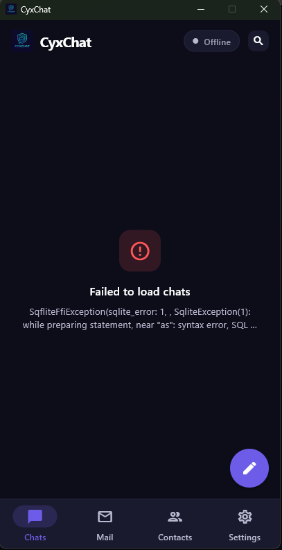
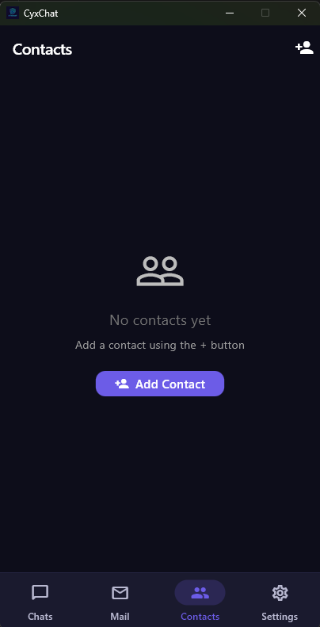
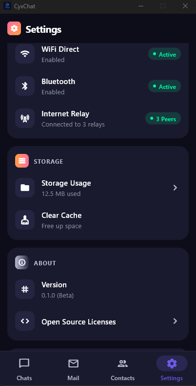
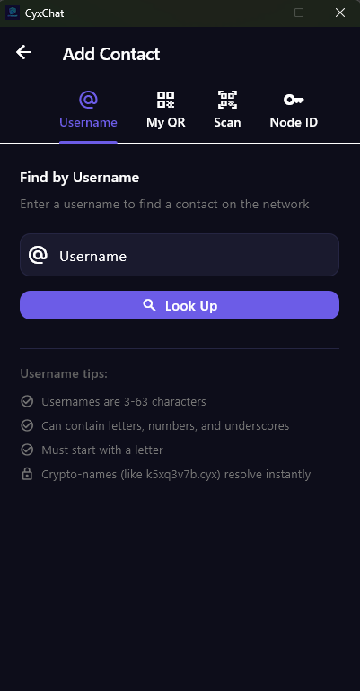

# CyxChat

Privacy-first messaging application built on the [CyxWiz](https://github.com/code3hr/cyxwiz) mesh network protocol.

## Features

- **True Privacy**: No phone number, no email, no central server
- **End-to-End Encryption**: XChaCha20-Poly1305 with X25519 key exchange
- **Anonymous Routing**: Onion routing hides metadata
- **Offline Capable**: Messages queue and sync when reconnected
- **Group Chat**: Private groups with rotating keys
- **Cross-Platform**: Desktop (Windows, macOS, Linux) + Mobile (iOS, Android)

## Screenshots

| Chats | Contacts | Settings | Add Contact |
|:-----:|:--------:|:--------:|:-----------:|
|  |  |  |  |

## Architecture

```
┌─────────────────────────────────────────────────────────┐
│                    Flutter App                          │
│  ┌─────────┐  ┌─────────┐  ┌─────────┐  ┌─────────┐   │
│  │  Chat   │  │ Contact │  │  Group  │  │ Settings│   │
│  └────┬────┘  └────┬────┘  └────┬────┘  └────┬────┘   │
│       └────────────┴────────────┴────────────┘         │
│                        │ FFI                            │
├────────────────────────┼────────────────────────────────┤
│                   libcyxchat                            │
│  ┌─────────┐  ┌─────────┐  ┌─────────┐  ┌─────────┐   │
│  │  Chat   │  │ Contact │  │  Group  │  │  File   │   │
│  └────┬────┘  └────┬────┘  └────┬────┘  └────┬────┘   │
│       └────────────┴────────────┴────────────┘         │
│                        │                                │
├────────────────────────┼────────────────────────────────┤
│                    libcyxwiz                            │
│  ┌─────────┐  ┌─────────┐  ┌─────────┐  ┌─────────┐   │
│  │  Onion  │  │ Routing │  │  Peer   │  │ Crypto  │   │
│  └─────────┘  └─────────┘  └─────────┘  └─────────┘   │
└─────────────────────────────────────────────────────────┘
```

## Building

### Prerequisites

- CMake 3.16+
- C11 compiler (GCC, Clang, MSVC)
- libsodium
- Flutter SDK (for app)

### Build the C Library

```bash
cd lib
cmake -B build -DCMAKE_BUILD_TYPE=Release
cmake --build build
```

### Run Tests

```bash
cd lib/build
ctest --output-on-failure
```

### Build the Flutter App

```bash
cd app
flutter pub get
flutter build windows  # or macos, linux, apk, ios
```

## Project Structure

```
cyxchat/
├── lib/                    # C library (libcyxchat)
│   ├── include/cyxchat/    # Public headers
│   │   ├── types.h         # Common types and constants
│   │   ├── chat.h          # Direct messaging API
│   │   ├── contact.h       # Contact management API
│   │   ├── group.h         # Group chat API
│   │   ├── file.h          # File transfer API
│   │   └── presence.h      # Online status API
│   ├── src/                # Implementation
│   └── tests/              # Unit tests
├── app/                    # Flutter application
│   ├── lib/
│   │   ├── models/         # Data models
│   │   ├── services/       # Business logic
│   │   ├── providers/      # State management
│   │   ├── screens/        # UI screens
│   │   └── ffi/            # Native bindings
│   └── pubspec.yaml
├── docs/                   # Documentation
└── scripts/                # Build scripts
```

## API Overview

### Initialize

```c
#include <cyxchat/cyxchat.h>

// Initialize library
cyxchat_init();

// Create chat context
cyxchat_ctx_t *ctx;
cyxchat_create(&ctx, onion_ctx);

// Set callbacks
cyxchat_set_on_message(ctx, on_message_received, NULL);
```

### Send Message

```c
cyxchat_msg_id_t msg_id;
cyxchat_send_text(ctx, &recipient_id, "Hello!", 6, NULL, &msg_id);
```

### Contacts

```c
cyxchat_contact_list_t *contacts;
cyxchat_contact_list_create(&contacts);

cyxchat_contact_add(contacts, &node_id, "Alice", pubkey);
cyxchat_contact_set_verified(contacts, &node_id, 1);
```

### Groups

```c
cyxchat_group_ctx_t *group_ctx;
cyxchat_group_ctx_create(&group_ctx, ctx);

cyxchat_group_id_t group_id;
cyxchat_group_create(group_ctx, "Family", &group_id);
cyxchat_group_invite(group_ctx, &group_id, &member_id, member_pubkey);
```

## Security

| Layer | Algorithm | Purpose |
|-------|-----------|---------|
| Message | XChaCha20-Poly1305 | End-to-end encryption |
| Routing | Onion (3 hops) | Metadata protection |
| Key Exchange | X25519 | Establish shared secrets |
| Hashing | BLAKE2b | Integrity verification |

## Documentation

- [Architecture](docs/ARCHITECTURE.md) - System design
- [API Reference](docs/API.md) - C library API
- [Database Schema](docs/DATABASE.md) - Local storage
- [Quick Start](QUICKSTART.md) - Getting started guide

## License

MIT License - see LICENSE file for details.

## Contributing

1. Fork the repository
2. Create a feature branch
3. Make your changes
4. Run tests
5. Submit a pull request

---

Code by [code3hr](https://github.com/code3hr)
