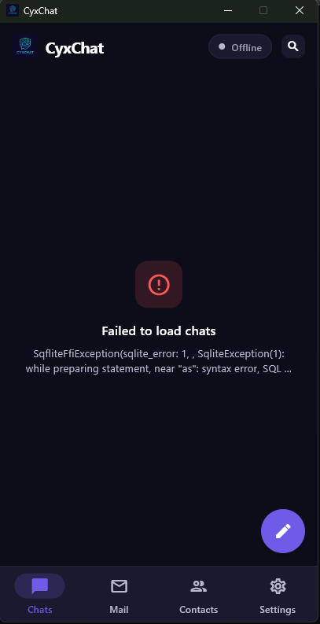
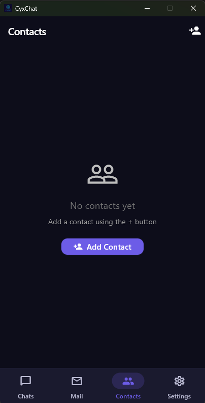
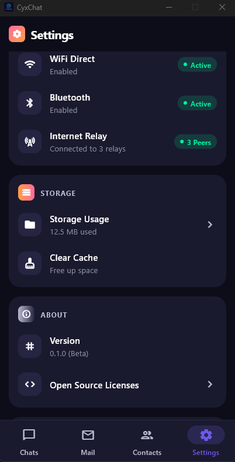
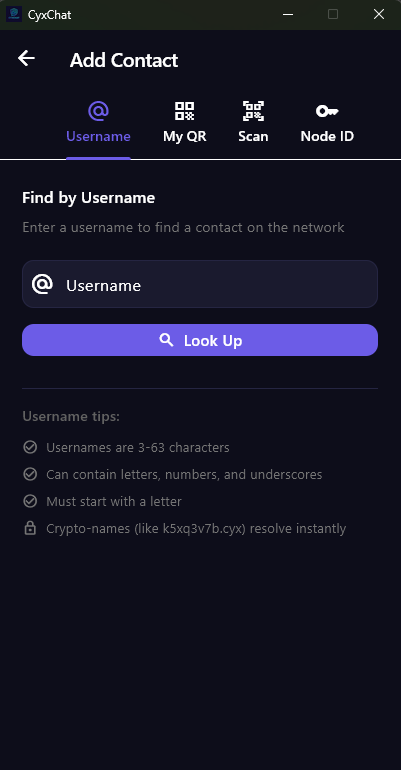

# CyxChat

Privacy-first messaging application built on the [CyxWiz](https://github.com/code3hr/conspiracy) mesh network protocol.

## Features

- **True Privacy**: No phone number, no email, no central server
- **End-to-End Encryption**: XChaCha20-Poly1305 with X25519 key exchange
- **Anonymous Routing**: Onion routing hides metadata
- **Voice Messages**: Hold-to-record, automatic playback with speed control
- **File Transfer**: Send files up to 64KB via onion routing (larger with direct mode)
- **Offline Capable**: Messages queue and sync when reconnected
- **Group Chat**: Private groups with rotating keys
- **Cross-Platform**: Desktop (Windows, macOS, Linux) + Mobile (iOS, Android)

## Screenshots

| Chats | Contacts | Settings | Add Contact |
|:-----:|:--------:|:--------:|:-----------:|
|  |  |  |  |

---

## Quick Start Guide

CyxChat requires the **CyxWiz protocol library** as a dependency. Clone the parent conspiracy repository which contains both.

### Step 1: Clone the Repository

```bash
git clone https://github.com/code3hr/conspiracy.git
cd conspiracy
```

### Step 2: Install Dependencies

**Windows** (via vcpkg):
```powershell
vcpkg install libsodium:x64-windows
```

**Linux**:
```bash
sudo apt install build-essential cmake libsodium-dev
```

**macOS**:
```bash
brew install cmake libsodium
```

### Step 3: Build CyxWiz Protocol Library

From the conspiracy root:
```bash
cmake -B build -DCMAKE_BUILD_TYPE=Release
cmake --build build --config Release
```

### Step 4: Build CyxChat C Library

```bash
cd cyxchat/lib
cmake -B build -DCMAKE_BUILD_TYPE=Release
cmake --build build --config Release
```

### Step 5: Copy Native Library to Flutter App

**Windows:** `copy lib\build\Release\cyxchat.dll app\`
**Linux:** `cp lib/build/libcyxchat.so app/`
**macOS:** `cp lib/build/libcyxchat.dylib app/`

### Step 6: Run the Bootstrap Server

From conspiracy root:
```bash
./build/cyxwizd
```

In the daemon prompt:
```
/bootstrap 7777
```

Keep this running while testing.

### Step 7: Run the Flutter App

```bash
cd cyxchat/app
flutter pub get
flutter run -d windows  # or linux, macos
```

In app settings, set bootstrap to `127.0.0.1:7777`

---

## Usage Guide

### First Launch

On first launch, CyxChat automatically:
1. **Generates your identity** - A unique UUID v4 Node ID (your address)
2. **Creates encryption keys** - X25519 for key exchange, XChaCha20-Poly1305 for messages
3. **Connects to bootstrap** - Registers with the network

### Your Node ID

Your Node ID is your identity on the network - like a phone number, but anonymous.

Format: `xxxxxxxx-xxxx-xxxx-xxxx-xxxxxxxxxxxx` (UUID v4)

1. Go to **Settings** (gear icon)
2. Tap your **profile card** at the top
3. Your full Node ID appears - tap to copy
4. Share this with contacts (or scan their QR code)

### Adding Contacts

**Method 1: By Node ID**
1. Go to **Contacts** tab
2. Tap **+** button
3. Paste their UUID Node ID (e.g., `af494fe2-292e-4aaf-9502-56b0d4e41f93`)
4. (Optional) Add a display name
5. Tap **Add Contact**

**Method 2: QR Code** (coming soon)
1. Go to **Contacts** → **+** → **Scan QR**
2. Scan their QR code from Settings

### Sending Messages

1. Tap a contact to open chat
2. Type your message (up to 4096 characters supported)
3. Tap send

**Message Status Icons:**
- ⏳ Pending - queued locally
- ✓ Sent - delivered to network
- ✓✓ Delivered - recipient received
- 👁 Read - recipient opened

### Long Messages

Messages over 80 bytes are automatically **fragmented** into chunks:
- Sent via onion routing (anonymous)
- Reassembled on recipient's device
- Works transparently - just type and send!

### Voice Messages

Hold the microphone button to record, release to send:

1. In chat, tap and **hold** the microphone icon (appears when text field is empty)
2. Record your message (up to 5 minutes)
3. **Release** to send, or slide left to cancel
4. Voice message is compressed (AAC, ~64kbps) and sent via onion routing

**Playback:**
- Tap the **play button** to listen
- Tap **speed** (1x/1.5x/2x) to change playback rate
- Progress bar shows position

**Transfer Times** (via onion routing):
| Duration | Size | Transfer Time |
|----------|------|---------------|
| 2 seconds | ~18KB | ~50 seconds |
| 5 seconds | ~40KB | ~2 minutes |
| 30 seconds | ~240KB | ~10 minutes |

*Note: Enable "Fast File Transfer" in Settings for instant transfers (trades privacy for speed)*

### File Transfer

Attach files using the paperclip icon:

**Onion Mode** (default, private):
- Max file size: 64KB
- IP address hidden from recipient
- Transfer rate: ~4 chunks/second (90-byte chunks)
- Best for: Text, small images, short voice messages

**Direct Mode** (fast):
- Max file size: 4GB
- Enable in Settings → Privacy → Fast File Transfer
- Transfer rate: Unlimited (32KB chunks)
- Warning: Recipient can see your IP address

**How Direct Mode Works:**

When direct mode is enabled, peers securely exchange their public IP addresses before transferring:

1. Sender's public IP:port is discovered via STUN
2. Before sending file, sender shares address via onion routing (stays private from relays)
3. Receiver adds sender's address to their UDP transport
4. File chunks flow directly peer-to-peer (32KB each, no rate limit)
5. Transfer completes in seconds instead of minutes

```
Onion Mode:  Sender → Relay → Relay → Relay → Receiver  (slow, private)
Direct Mode: Sender ←――――――― UDP ―――――――→ Receiver     (fast, IP visible)
```

*The address exchange itself uses onion routing, so relay nodes never learn either peer's IP address.*

### Settings

| Setting | Description |
|---------|-------------|
| **Bootstrap Server** | Network entry point (default: `127.0.0.1:7777`) |
| **Display Name** | Your name shown to contacts |
| **Node ID** | Your unique address (UUID format, tap to copy) |
| **Network Status** | Shows connection state and peer count |
| **Fast File Transfer** | Enable direct P2P for large files (exposes IP) |

### Network Requirements

- **UDP ports**: CyxChat uses UDP for peer-to-peer connections
- **NAT traversal**: Automatic via STUN (works behind most routers)
- **Bootstrap server**: Required for initial peer discovery

---

## Running Multiple Instances (Testing)

**Terminal 1 - Instance A:**
```bash
cd cyxchat/app
flutter run -d windows
```

**Terminal 2 - Instance B:**
```bash
cd cyxchat/app
flutter run -d windows --dart-define=INSTANCE_ID=2
```

Each instance gets its own identity and database. Add each other using Node ID from Settings.

---

## Architecture

```
┌─────────────────────────────────────────────────────────┐
│                    Flutter App                          │
│  ┌─────────┐  ┌─────────┐  ┌─────────┐  ┌─────────┐   │
│  │  Chat   │  │ Contact │  │  Group  │  │ Settings│   │
│  └────┬────┘  └────┬────┘  └────┬────┘  └────┬────┘   │
│       └────────────┴────────────┴────────────┘         │
│                        │ FFI                            │
├────────────────────────┼────────────────────────────────┤
│                   libcyxchat                            │
│  ┌─────────┐  ┌─────────┐  ┌─────────┐  ┌─────────┐   │
│  │  Chat   │  │ Contact │  │  Group  │  │  File   │   │
│  └────┬────┘  └────┬────┘  └────┬────┘  └────┬────┘   │
│       └────────────┴────────────┴────────────┘         │
│                        │                                │
├────────────────────────┼────────────────────────────────┤
│                    libcyxwiz                            │
│  ┌─────────┐  ┌─────────┐  ┌─────────┐  ┌─────────┐   │
│  │  Onion  │  │ Routing │  │  Peer   │  │ Crypto  │   │
│  └─────────┘  └─────────┘  └─────────┘  └─────────┘   │
└─────────────────────────────────────────────────────────┘
```

## Building

### Prerequisites

- CMake 3.16+
- C11 compiler (GCC, Clang, MSVC)
- libsodium
- Flutter SDK (for app)

### Build the C Library

```bash
cd lib
cmake -B build -DCMAKE_BUILD_TYPE=Release
cmake --build build
```

### Run Tests

```bash
cd lib/build
ctest --output-on-failure
```

### Build the Flutter App

```bash
cd app
flutter pub get
flutter build windows  # or macos, linux, apk, ios
```

## Project Structure

```
cyxchat/
├── lib/                    # C library (libcyxchat)
│   ├── include/cyxchat/    # Public headers
│   │   ├── types.h         # Common types and constants
│   │   ├── chat.h          # Direct messaging API
│   │   ├── contact.h       # Contact management API
│   │   ├── group.h         # Group chat API
│   │   ├── file.h          # File transfer API
│   │   └── presence.h      # Online status API
│   ├── src/                # Implementation
│   └── tests/              # Unit tests
├── app/                    # Flutter application
│   ├── lib/
│   │   ├── models/         # Data models
│   │   ├── services/       # Business logic
│   │   ├── providers/      # State management
│   │   ├── screens/        # UI screens
│   │   └── ffi/            # Native bindings
│   └── pubspec.yaml
├── docs/                   # Documentation
└── scripts/                # Build scripts
```

## API Overview

### Initialize

```c
#include <cyxchat/cyxchat.h>

// Initialize library
cyxchat_init();

// Create chat context
cyxchat_ctx_t *ctx;
cyxchat_create(&ctx, onion_ctx);

// Set callbacks
cyxchat_set_on_message(ctx, on_message_received, NULL);
```

### Send Message

```c
cyxchat_msg_id_t msg_id;
cyxchat_send_text(ctx, &recipient_id, "Hello!", 6, NULL, &msg_id);
```

### Contacts

```c
cyxchat_contact_list_t *contacts;
cyxchat_contact_list_create(&contacts);

cyxchat_contact_add(contacts, &node_id, "Alice", pubkey);
cyxchat_contact_set_verified(contacts, &node_id, 1);
```

### Groups

```c
cyxchat_group_ctx_t *group_ctx;
cyxchat_group_ctx_create(&group_ctx, ctx);

cyxchat_group_id_t group_id;
cyxchat_group_create(group_ctx, "Family", &group_id);
cyxchat_group_invite(group_ctx, &group_id, &member_id, member_pubkey);
```

## Security

| Layer | Algorithm | Purpose |
|-------|-----------|---------|
| Message | XChaCha20-Poly1305 | End-to-end encryption |
| Routing | Onion (3 hops) | Metadata protection |
| Key Exchange | X25519 | Establish shared secrets |
| Hashing | BLAKE2b | Integrity verification |

## Troubleshooting

### Bootstrap connection failed
1. Ensure bootstrap server is running (`./build/cyxwizd` then `/bootstrap 7777`)
2. Check firewall allows UDP on that port
3. Verify bootstrap address in app settings

### Peer not found or messages not sending
1. Both peers must use the same bootstrap server
2. Wait for key exchange to complete (see logs)
3. NAT traversal may take a few seconds

### Windows: DLL not found
Copy `cyxchat.dll` to the app directory or add to PATH.

### Linux: libsodium not found
```bash
sudo ldconfig
export LD_LIBRARY_PATH=/usr/local/lib:$LD_LIBRARY_PATH
```

---

## Documentation

- [Architecture](docs/ARCHITECTURE.md) - System design
- [NAT Traversal](docs/NAT-TRAVERSAL.md) - How peer connectivity works
- [DNS](docs/DNS.md) - Username resolution system

## License

MIT License - see LICENSE file for details.

## Contributing

1. Fork the repository
2. Create a feature branch
3. Make your changes
4. Run tests
5. Submit a pull request

---

Code by [code3hr](https://github.com/code3hr)
